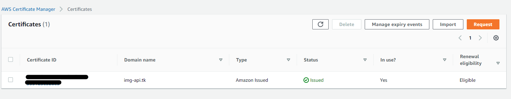
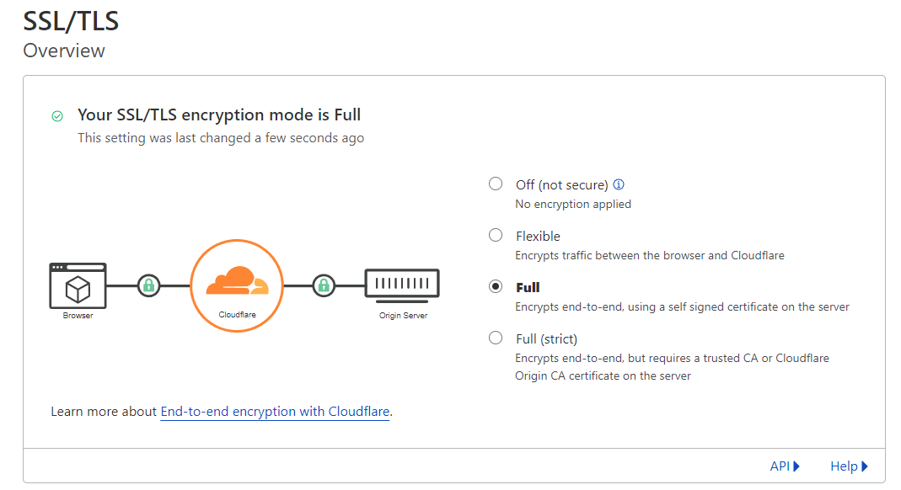
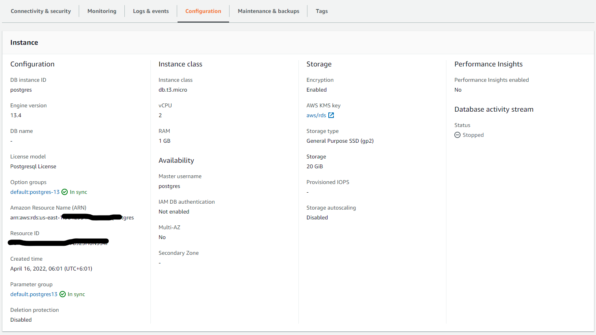
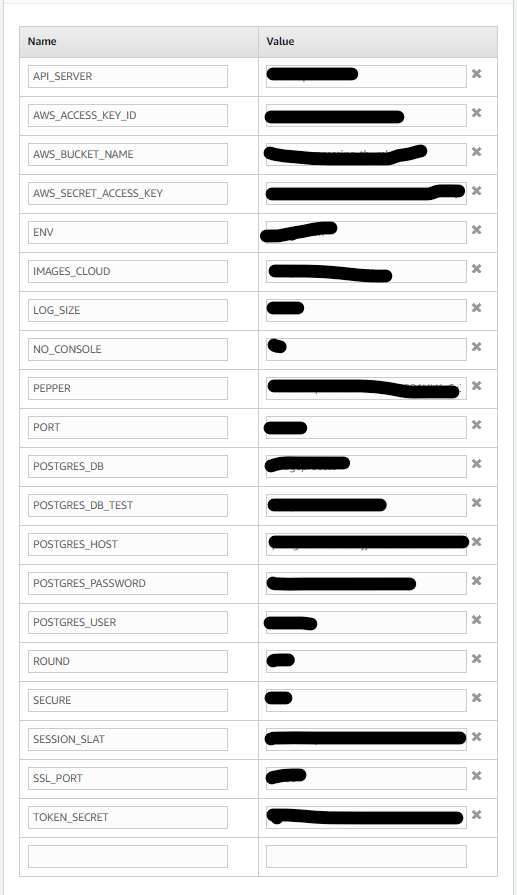
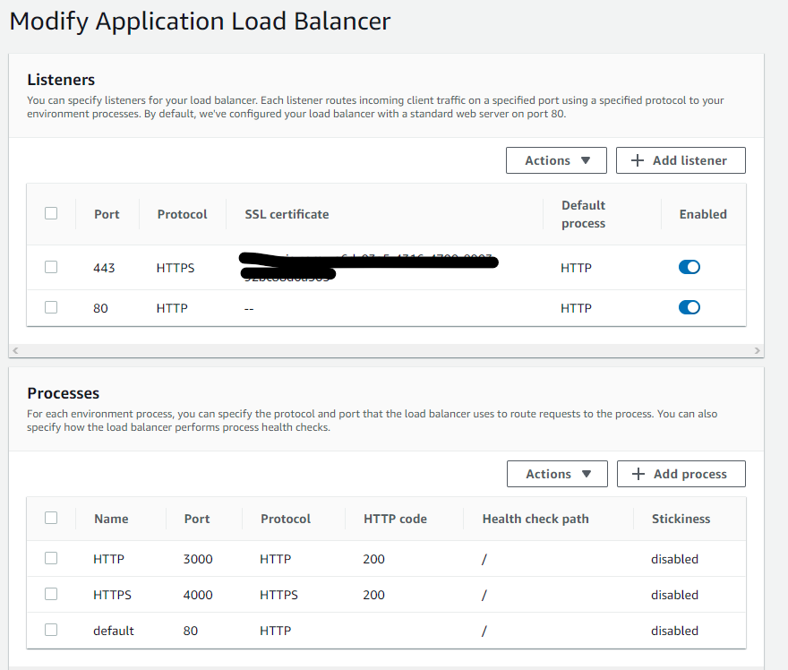
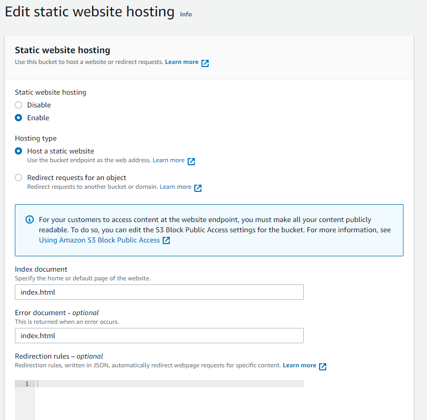
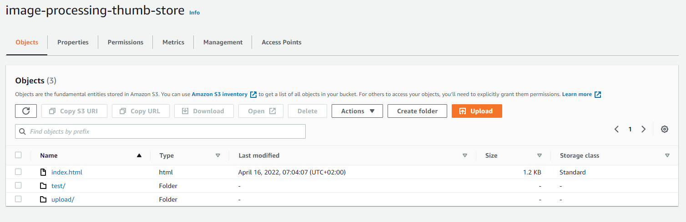
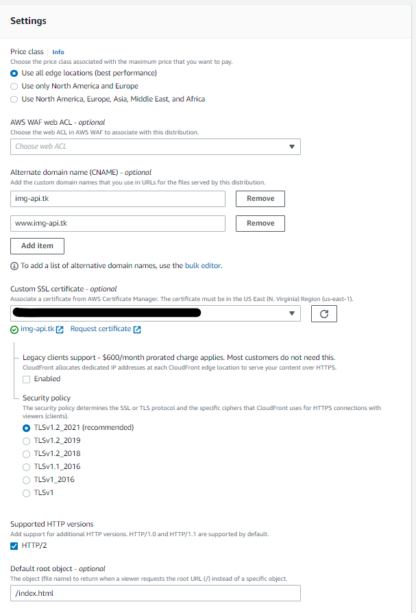
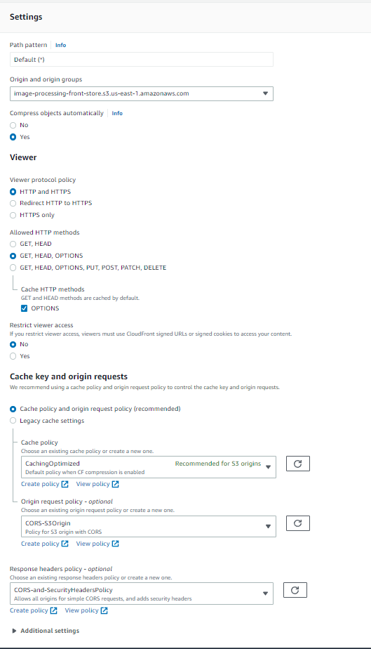
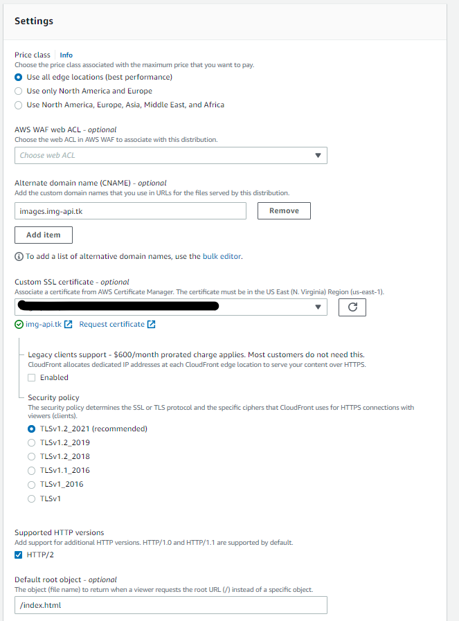

# Image Processing Frontend & Backend API With Deployment
[](https://circleci.com/gh/TarekElBarody/image-processing)
[](https://raw.githubusercontent.com/circleci/circleci-docs/master/LICENSE)

This is a full web app with full deployment process using :
- Backend Express & NodeJS & Postgres as an API Server [See Backend README](backend/README.md)
- Frontend application with a simple control panel with login feature Using React 18 [See Frontend README](frontend/README.md).
- AWS RDS PostgreSQL Database for store user data and images URLs.
- AWS Elastic Beanstalk for API Server
- AWS S3 Bucket for storing React App Static Files
- AWS S3 Bucket for Store Images uploaded to API
- AWS CloudFront for demonstrate caching and speed delivery for React Static File from S3 Bucket
- AWS CloudFront for S3 Bucket that hold the images for best catching techniques and prevent public access
- CircleCI Platform to Create Pipeline and CI/CD deployment
- Cloudflare for domain name point to servers


# Table of contents:

- [Environment Setup](#Environment-Setup)
- [App Directory](#App-Directory)
- [Deployment Diagram](#Deployment-Diagram)
- [AWS Certifcate Manager AND Cloudflare configuration](#AWS-Certifcate-Manager-AND-Cloudflare-configuration)
- [AWS Configuration](#Running-the-server)
	 - [RDS PostgreSQL Server](#RDS-PostgreSQL-Server)
	 - [Elastic Beanstalk Environment](#Elastic-Beanstalk-Environment)
	 - [S3 Bucket For React Static Site](#S3-Bucket-For-React-Static-Site)
	 - [S3 Bucket For Store Images](#S3-Bucket-For-Store-Images)
	 - [CloudFront for S3 Static Bucket](#CloudFront-for-S3-Static-Bucket)
	 - [CloudFront for S3 Images Store](#CloudFront-for-S3-Images-Store)
- [CircleCI Pipeline](#App-Directory) 
	 - [Configure CircleCI Pipeline](#Configure-CircleCI-Pipeline)
	 - [Setup Enviroment Virables on CircleCI Settings](#Setup-Enviroment-Virables-on-CircleCI-Settings)
- [Access Web Control Panel](#Access-Web-Control-Panel)


# Environment Setup 
> get the repo from the GitHub

```ssh
git clone https://github.com/TarekElBarody/image-processing.git
cd  image-processing
```

> Follow the structured inside every stack folder we have
- Backend API Server [See Backend README](backend/README.md)
- Frontend application React 18 [See Frontend README](frontend/README.md)

> you can use the root package.json to call install and build for both stack folder

```ssh
npm frontend:install
npm frontend:build

npm backend:install
npm backend:build

```

# App Directory 
```
  - .circleci         # CircleCI Configuration Folder
    - config.yml      # CircleCI Configuration file for deployment pipeline script
  - backend           # Backend Express & NodeJS Project folder
  - frontend          # Frontend application React App Folder
  - runbooks          # A container of .md file explain all function needed to run AWS Services
  - screenshots       # Contain All Screenshots that needed for README files
  - package.json      # store all script and module and configuration for node project
  

```

# Deployment Diagram


# AWS Certifcate Manager AND Cloudflare configuration
> We use a sample domain name to work on it like ( img-api.tk )

> You can use your own domain follow the steps and change img-api.tk with your domain
* Requesting a public certificate on AWS Certifcate Manager [see documentation](https://docs.aws.amazon.com/acm/latest/userguide/gs-acm-request-public.html)
* Add img-api.tk and *.img-api.tk to your request then copy the CNAME filed to your domain DNS Provider to proccess Validation 




* We use Cloudflare as DNS Manager so we add those DNS Records on CloudFlare Domain DNS Page
	- Create eb.img-api.tk CNAME Record and point it to your Elastic Beanstalk Host Name
	- Create images.img-api.tk CNAME Record and point it to your Images CloudFront Concted to Images S3 Bucket
	- Create www.img-api.tk CNAME Record and point it to your React App CloudFront Concted to React Static S3 Bucket
	- Create A Record with @ or img-api.tk and point it to the AWS CloudFront Server IP Address 

	

	- Create Cloudflare Client Certificates

	

	- Enable Cloudflare SSL/TLS

	

# AWS Configuration

## RDS PostgreSQL Server
> Follow the structured linkes to can setup and configure RDS PostgreSQL 

* Setting up for Amazon RDS [see documentation](https://docs.aws.amazon.com/AmazonRDS/latest/UserGuide/CHAP_SettingUp.html#CHAP_SettingUp.IAM)
* Creating a PostgreSQL DB instance and connecting to a database on a PostgreSQL DB instance [see documentation](https://docs.aws.amazon.com/AmazonRDS/latest/UserGuide/CHAP_GettingStarted.CreatingConnecting.PostgreSQL.html)
* Create the Database [see it on backend documentation](backend/README.md)
* Follow Database Schema [see it on backend database documentation](backend/Database-Schema.md)
* Our Final Setup Screenshot




## Elastic Beanstalk Environment
> Follow the structured linkes to can setup and configure Elastic Beanstalk Server
* Creating an Elastic Beanstalk environment [see documentation](https://docs.aws.amazon.com/elasticbeanstalk/latest/dg/using-features.environments.html)
* The create new environment wizard [see documentation](https://docs.aws.amazon.com/elasticbeanstalk/latest/dg/environments-create-wizard.html)
* Managing Elastic Beanstalk environments with the EB CLI [see documentation](https://docs.aws.amazon.com/elasticbeanstalk/latest/dg/eb-cli3-getting-started.html)
* Our Final Setup Screenshot

	- Environment Home

	

	- Environment Configuration

	

	- Environment Load Balance Setup

	


## S3 Bucket For React Static Site
> Follow the structured linkes to can setup and configure AWS S3 Bucket

> We Turn Off public access becuse we use AWS CloudFront to serve the static files
* Creating a bucket [see documentation](https://docs.aws.amazon.com/AmazonS3/latest/userguide/create-bucket-overview.html)
* Blocking public access to your Amazon S3 storage [see documentation](https://docs.aws.amazon.com/AmazonS3/latest/userguide/access-control-block-public-access.html)
* Enabling website hosting [see documentation](https://docs.aws.amazon.com/AmazonS3/latest/userguide/EnableWebsiteHosting.html) Be sure to set Error document to index.html to can react router work propply
* Cross-origin resource sharing (CORS)  on Permissions tab
```
[
    {
        "AllowedHeaders": [],
        "AllowedMethods": [
            "GET",
            "HEAD"
        ],
        "AllowedOrigins": [
            "*"
        ],
        "ExposeHeaders": []
    }
]
```
* Bucket policy on Permissions tab
```
{
    "Version": "2012-10-17",
    "Statement": [
        {
            "Effect": "Allow",
            "Principal": {
                "AWS": "arn:aws:iam::<Account ID>:user/<IAM Username>"
            },
            "Action": [
                "s3:GetObject",
                "s3:PutObject",
                "s3:PutObjectAcl",
                "s3:DeleteObject"
            ],
            "Resource": "arn:aws:s3:::image-processing-front-store/*"
        },
        {
            "Sid": "2",
            "Effect": "Allow",
            "Principal": {
                "AWS": "arn:aws:iam::cloudfront:user/CloudFront Origin Access Identity <OAI ID>"
            },
            "Action": "s3:GetObject",
            "Resource": "arn:aws:s3:::image-processing-front-store/*"
        }
    ]
}
```


* Our Final Setup Screenshot




## S3 Bucket For Store Images
> Follow the structured linkes to can setup and configure AWS S3 Bucket

> We Turn Off public access becuse we use AWS CloudFront to serve the images
* Creating a bucket [see documentation](https://docs.aws.amazon.com/AmazonS3/latest/userguide/create-bucket-overview.html)
* Blocking public access to your Amazon S3 storage [see documentation](https://docs.aws.amazon.com/AmazonS3/latest/userguide/access-control-block-public-access.html)
* Enabling website hosting [see documentation](https://docs.aws.amazon.com/AmazonS3/latest/userguide/EnableWebsiteHosting.html) Be sure to set Error document to index.html to redirect 403 access denied
* Cross-origin resource sharing (CORS)  on Permissions tab
```
[
    {
        "AllowedHeaders": [],
        "AllowedMethods": [
            "GET",
            "HEAD"
        ],
        "AllowedOrigins": [
            "*"
        ],
        "ExposeHeaders": []
    }
]
```
* Bucket policy on Permissions tab
```
{
	"Version": "2008-10-17",
	"Id": "PolicyForCloudFrontPrivateContent",
	"Statement": [
		{
			"Effect": "Allow",
			"Principal": {
				"AWS": "arn:aws:iam::<Account ID>:user/<IAM Username>"
			},
			"Action": [
				"s3:GetObject",
				"s3:PutObject",
				"s3:PutObjectAcl",
				"s3:DeleteObject"
			],
			"Resource": "arn:aws:s3:::image-processing-thumb-store/*"
		},
		{
			"Sid": "1",
			"Effect": "Allow",
			"Principal": {
				"AWS": "arn:aws:iam::cloudfront:user/CloudFront Origin Access Identity <OAI ID>"
			},
			"Action": "s3:GetObject",
			"Resource": "arn:aws:s3:::image-processing-thumb-store/*"
		}
	]
}
```
* Create a file index.html to serve 403 error documents and uploaded to the bucket
```
<!DOCTYPE html><html lang="en"><head><meta charset="utf-8"><meta name="viewport" content="width=device-width, initial-scale=1, shrink-to-fit=no"><title>403 Access Denied</title><style>body{color: #444; margin: 0; font: normal 14px/20px Arial, Helvetica, sans-serif; height: 100%; background-color: #fff;}.Container{height: auto; min-height: 100%;}.Card{text-align: center; width: 800px; margin-left: -400px; position: absolute; top: 30%; left: 50%;}h1{margin: 0; font-size: 150px; line-height: 150px; font-weight: bold;}h2{margin-top: 20px; font-size: 30px;}</style></head><body><div class="Container"><div class="Card"><h1>403</h1><h2>Access Denied</h2><p>You don't have permission to access this object!</p></div></div></body></html>

```

* Our Final Setup Screenshot




## CloudFront for S3 Static Bucket
> Follow the structured linkes to can setup and configure AWS S3 Bucket

> Turn Off public access on S3 Bbucket to extra secure we use AWS CloudFront to serve the static files
* Restricting access to Amazon S3 content by using an origin access identity (OAI) [see documentation](https://docs.aws.amazon.com/AmazonCloudFront/latest/DeveloperGuide/private-content-restricting-access-to-s3.html)
* Deploy a React-based single-page application to Amazon S3 and CloudFront [see documentation](https://docs.aws.amazon.com/prescriptive-guidance/latest/patterns/deploy-a-react-based-single-page-application-to-amazon-s3-and-cloudfront.html)
* Creating a distribution and point img-api.tk and www.img-api.tk to the CNAME section and select domain certificate from ssl  [see documentation](https://docs.aws.amazon.com/AmazonCloudFront/latest/DeveloperGuide/distribution-web-creating-console.html) 
* S3 origin with CloudFront[see documentation](https://docs.aws.amazon.com/whitepapers/latest/secure-content-delivery-amazon-cloudfront/s3-origin-with-cloudfront.html) 

* Our Final Setup Screenshot








## CloudFront for S3 Images Store
> Follow the structured linkes to can setup and configure AWS S3 Bucket

> Turn Off public access on S3 Bbucket to extra secure we use AWS CloudFront to serve the static files
* Restricting access to Amazon S3 content by using an origin access identity (OAI) [see documentation](https://docs.aws.amazon.com/AmazonCloudFront/latest/DeveloperGuide/private-content-restricting-access-to-s3.html)
* Deploy a React-based single-page application to Amazon S3 and CloudFront [see documentation](https://docs.aws.amazon.com/prescriptive-guidance/latest/patterns/deploy-a-react-based-single-page-application-to-amazon-s3-and-cloudfront.html)
* Creating a distribution and point images.img-api.tk to the CNAME section and select domain certificate from ssl [see documentation](https://docs.aws.amazon.com/AmazonCloudFront/latest/DeveloperGuide/distribution-web-creating-console.html) 
* S3 origin with CloudFront [see documentation](https://docs.aws.amazon.com/whitepapers/latest/secure-content-delivery-amazon-cloudfront/s3-origin-with-cloudfront.html) 

* Our Final Setup Screenshot
> Same configuration but on origin we use images.img-api.tk




# CircleCI Pipeline

## Configure CircleCI Pipeline
> The configuration inside .circleci/config.yml
```
version: 2.1
orbs: # services included from cercleci to be instaled on the docker image
  node: circleci/node@5.0.2
  aws-cli: circleci/aws-cli@3.0.0

jobs: # deployment jobs

  build-front: # job to build and install dependencies for frontend react app
    docker: # configure the docker image
      - image: cimg/base:stable
    steps: # steps inside the job to run sequantly
      - node/install # installing nodejs
      - checkout # checkout the workspace to ensure we are running on our repo
      - run: # to tell cercleci to run the following command
          name: Front-End Install
          command: npm run frontend:install
      - run:
          name: Front-End build
          command: npm run frontend:build
      - persist_to_workspace: # save the working directory to work space to use it in the next job
          root: ~/project # save the workspace at project folder root
          paths: # include pathes to save
            - .
  
  test-front: # job to test the front end react app
    docker:
      - image: cimg/base:stable
    steps:
      - node/install
      - checkout
      - attach_workspace: # attaching the saved workspace from last job
          at: ~/project # from the root project we defined before
      - run:
          name: Front-End test
          command: npm run frontend:test

  deploy-front: # job to deploy front end react app
    docker:
      - image: cimg/base:stable
    steps:
      - node/install
      - checkout
      - aws-cli/setup: # install aws-cli and configure it
          configure-default-region: true 
          configure-profile-region: false 
          disable-aws-pager: true 
          override-installed: false 
          aws-access-key-id: AWS_CLI_ACCESS_KEY_ID
          aws-secret-access-key: AWS_CLI_SECRET_ACCESS_KEY
          aws-region: AWS_CLI_REGION
          profile-name: aws-cli
      - attach_workspace: # attaching the saved workspace from last job
          at: ~/project
      - run:
          name: Front-End Deploy
          command: npm run frontend:deploy

  cloud-invalidation: # job to create invalidation for cached files from aws cloudfront after deployment
    docker:
      - image: cimg/base:stable
    steps:
      - node/install
      - checkout
      - aws-cli/setup: # install aws-cli and configure it
          configure-default-region: true 
          configure-profile-region: false 
          disable-aws-pager: true 
          override-installed: false 
          aws-access-key-id: AWS_CLI_ACCESS_KEY_ID
          aws-secret-access-key: AWS_CLI_SECRET_ACCESS_KEY
          aws-region: AWS_CLI_REGION
          profile-name: aws-cli
      - attach_workspace: # attaching the saved workspace from last job
          at: ~/project
      - run:
          name: Front-End Cloud Invalidation
          command: npm run frontend:invalidation

  build-back: # job to build and install dependencies for backend API server
    docker:
      - image: cimg/base:stable
    steps:
      - node/install
      - checkout
      - aws-cli/setup: # install aws-cli and configure it
          configure-default-region: true 
          configure-profile-region: true 
          disable-aws-pager: true 
          override-installed: false 
          aws-access-key-id: AWS_CLI_ACCESS_KEY_ID
          aws-secret-access-key: AWS_CLI_SECRET_ACCESS_KEY
          aws-region: AWS_CLI_REGION
          profile-name: aws-cli
      - run:
          name: Back-End Copy SSL Keys
          command: npm run backend:cert
      - run:
          name: Front-End Install
          command: npm run backend:install
      - run:
          name: Front-End build
          command: npm run backend:build
      - persist_to_workspace: # save the working directory to work space to use it in the next job
          root: ~/project
          paths:
            - .
  
  test-back: # job to test backend API server
    docker:
      - image: cimg/base:stable
    steps:
      - node/install
      - checkout
      - attach_workspace: # attaching the saved workspace from last job
          at: ~/project
      - run:
          name: Back-End test
          command: npm run backend:test

  deploy-back: # job to deploy backend API server to AWS Elastic Beanstalk
    docker:
      - image: cimg/base:stable
    steps:
      - node/install
      - checkout
      - aws-cli/setup: # install aws-cli and configure it
          configure-default-region: true 
          configure-profile-region: true 
          disable-aws-pager: true 
          override-installed: false 
          aws-access-key-id: AWS_CLI_ACCESS_KEY_ID
          aws-secret-access-key: AWS_CLI_SECRET_ACCESS_KEY
          aws-region: AWS_CLI_REGION
          profile-name: aws-cli
      - run: # install aws eb-cli 
          name: Installing deployment dependencies
          working_directory: /
          command: |
            sudo apt-get -y -qq update
            sudo apt-get install python3-pip python3-dev build-essential
            sudo pip3 install awsebcli
      - attach_workspace: # attaching the saved workspace from last job
          at: ~/project
      - checkout
      - run:
          name: Back-End Deploy
          command: npm run backend:deploy

  
workflows: # workflow to run jobs on conditional steps
  build-test-deploy: # work flow to build then test then deploy process
    jobs:
    # fornt end steps
      - build-front # call build job to build forntend dependencies
      - test-front: # call test job for testing frontend
          requires: # cannot process this job its require the build step
            - build-front      
      - deploy-front: # call deploy job to deploy frontend to aws s3 bucket
          requires: # cannot process this job its require the test step
            - test-front
          filters: # filter this job to run only on master bruch on our repo after pushing
            branches:
              only: main
      - cloud-invalidation: # call invalidation job to clear cached files from aws cloudfront after deployment
          requires: # cannot process this job its require the deploy step
            - deploy-front

    # backend steps
      - build-back # call build job to build backend dependencies
      - test-back: # call test job for testing backend
          requires: # cannot process this job its require the build step
            - build-back
      - deploy-back: # call deploy job to deploy backend  to aws elastic beanstalk
          requires: # cannot process this job its require the test step
            - test-back
          filters: # filter this job to run only on master bruch on our repo after pushing
            branches:
              only: main
      

```

### Screenshot for deploment
> Every stack run in parrell and depends on other jobs

> first build if succeded run test if succeded run deploy and eatch of front and end run in parrell 

