# Infrastructure Description

- [AWS Certifcate Manager AND Cloudflare configuration](#AWS-Certifcate-Manager-AND-Cloudflare-configuration)
- [AWS Configuration](#Running-the-server)
	 - [RDS PostgreSQL Server](#RDS-PostgreSQL-Server)
	 - [Elastic Beanstalk Environment](#Elastic-Beanstalk-Environment)
	 - [S3 Bucket For React Static Site](#S3-Bucket-For-React-Static-Site)
	 - [S3 Bucket For Store Images](#S3-Bucket-For-Store-Images)
	 - [CloudFront for S3 Static Bucket](#CloudFront-for-S3-Static-Bucket)
	 - [CloudFront for S3 Images Store](#CloudFront-for-S3-Images-Store)

# AWS Certifcate Manager AND Cloudflare configuration
> We use a sample domain name to work on it like ( img-api.tk )

> You can use your own domain follow the steps and change img-api.tk with your domain
* Requesting a public certificate on AWS Certifcate Manager [see documentation](https://docs.aws.amazon.com/acm/latest/userguide/gs-acm-request-public.html)
* Add img-api.tk and *.img-api.tk to your request then copy the CNAME filed to your domain DNS Provider to proccess Validation 

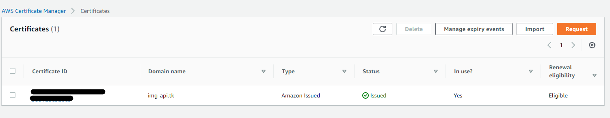

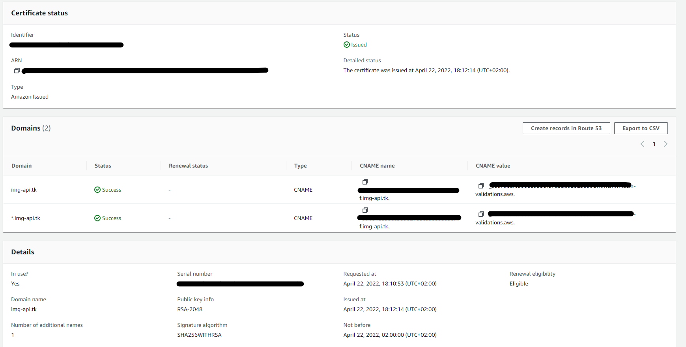

* We use Cloudflare as DNS Manager so we add those DNS Records on CloudFlare Domain DNS Page
	- Create eb.img-api.tk CNAME Record and point it to your Elastic Beanstalk Host Name
	- Create images.img-api.tk CNAME Record and point it to your Images CloudFront Concted to Images S3 Bucket
	- Create www.img-api.tk CNAME Record and point it to your React App CloudFront Concted to React Static S3 Bucket
	- Create A Record with @ or img-api.tk and point it to the AWS CloudFront Server IP Address 

	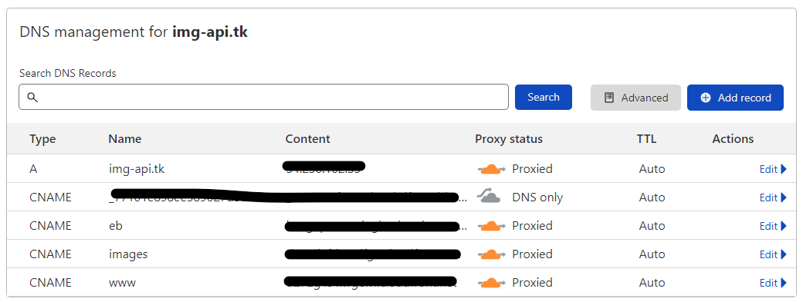

	- Create Cloudflare Client Certificates

	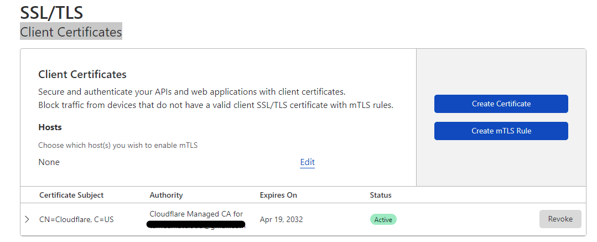

	- Enable Cloudflare SSL/TLS

	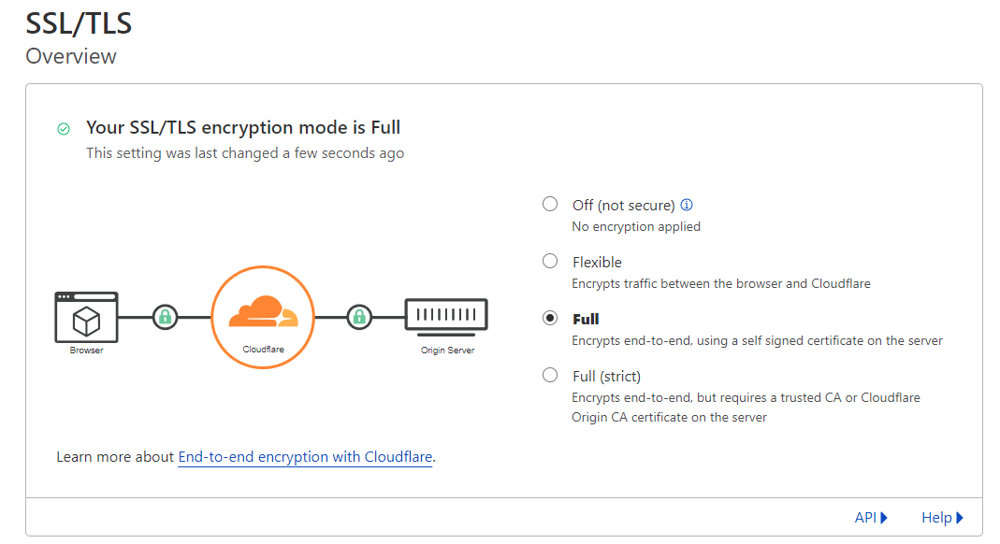

# AWS Configuration

## RDS PostgreSQL Server
> Follow the structured linkes to can setup and configure RDS PostgreSQL 

* Setting up for Amazon RDS [see documentation](https://docs.aws.amazon.com/AmazonRDS/latest/UserGuide/CHAP_SettingUp.html#CHAP_SettingUp.IAM)
* Creating a PostgreSQL DB instance and connecting to a database on a PostgreSQL DB instance [see documentation](https://docs.aws.amazon.com/AmazonRDS/latest/UserGuide/CHAP_GettingStarted.CreatingConnecting.PostgreSQL.html)
* Create the Database [see it on backend documentation](backend/README.md)
* Follow Database Schema [see it on backend database documentation](backend/Database-Schema.md)
* Our Final Setup Screenshot

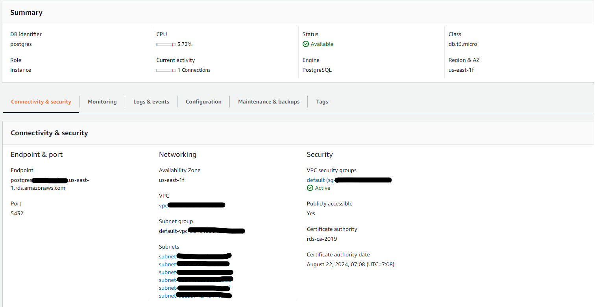

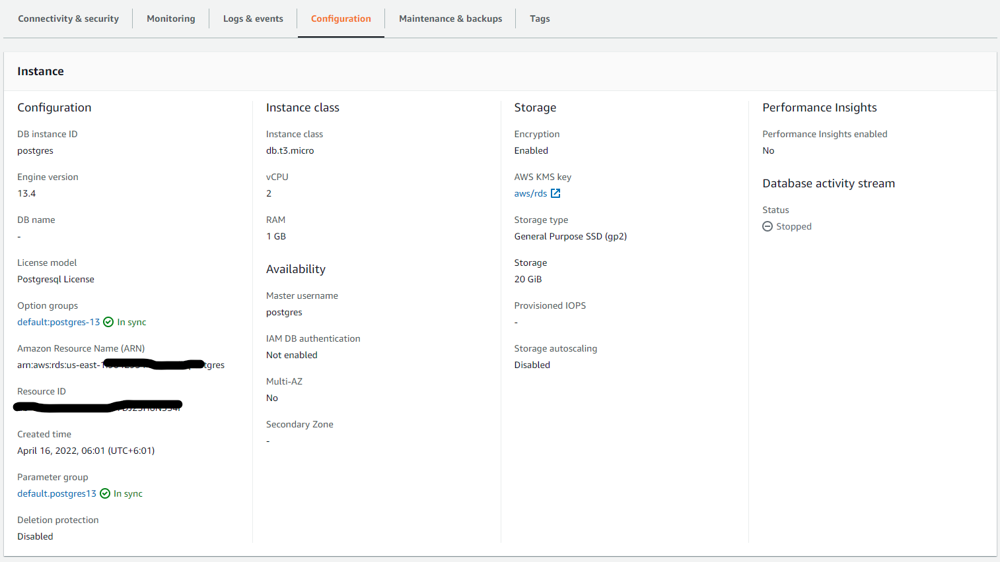

## Elastic Beanstalk Environment
> Follow the structured linkes to can setup and configure Elastic Beanstalk Server
* Creating an Elastic Beanstalk environment [see documentation](https://docs.aws.amazon.com/elasticbeanstalk/latest/dg/using-features.environments.html)
* The create new environment wizard [see documentation](https://docs.aws.amazon.com/elasticbeanstalk/latest/dg/environments-create-wizard.html)
* Managing Elastic Beanstalk environments with the EB CLI [see documentation](https://docs.aws.amazon.com/elasticbeanstalk/latest/dg/eb-cli3-getting-started.html)
* Our Final Setup Screenshot

	- Environment Home

	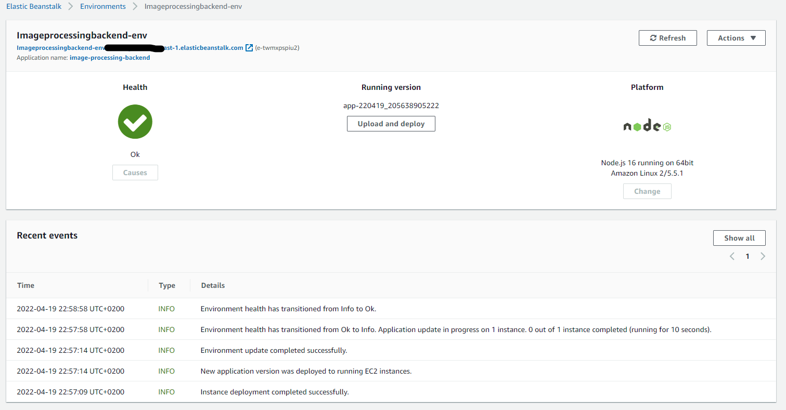

	- Environment Configuration

	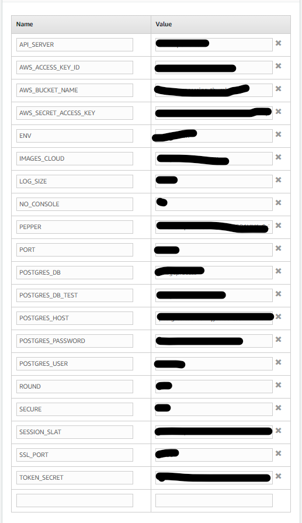

	- Environment Load Balance Setup

	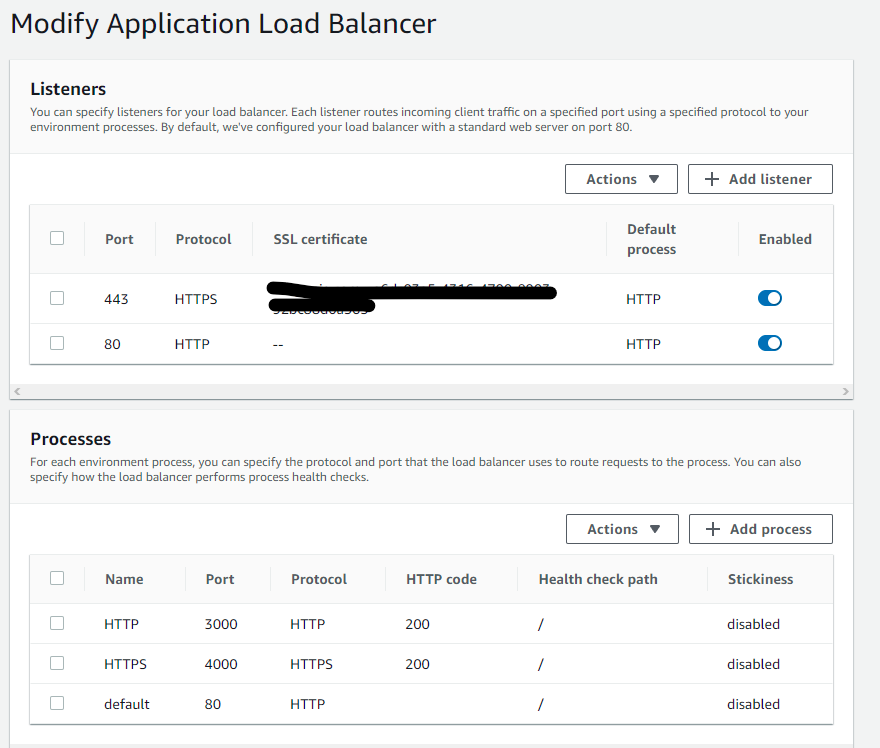


## S3 Bucket For React Static Site
> Follow the structured linkes to can setup and configure AWS S3 Bucket

> We Turn Off public access becuse we use AWS CloudFront to serve the static files
* Creating a bucket [see documentation](https://docs.aws.amazon.com/AmazonS3/latest/userguide/create-bucket-overview.html)
* Blocking public access to your Amazon S3 storage [see documentation](https://docs.aws.amazon.com/AmazonS3/latest/userguide/access-control-block-public-access.html)
* Enabling website hosting [see documentation](https://docs.aws.amazon.com/AmazonS3/latest/userguide/EnableWebsiteHosting.html) Be sure to set Error document to index.html to can react router work propply
* Cross-origin resource sharing (CORS)  on Permissions tab
```
[
    {
        "AllowedHeaders": [],
        "AllowedMethods": [
            "GET",
            "HEAD"
        ],
        "AllowedOrigins": [
            "*"
        ],
        "ExposeHeaders": []
    }
]
```
* Bucket policy on Permissions tab
```
{
    "Version": "2012-10-17",
    "Statement": [
        {
            "Effect": "Allow",
            "Principal": {
                "AWS": "arn:aws:iam::<Account ID>:user/<IAM Username>"
            },
            "Action": [
                "s3:GetObject",
                "s3:PutObject",
                "s3:PutObjectAcl",
                "s3:DeleteObject"
            ],
            "Resource": "arn:aws:s3:::image-processing-front-store/*"
        },
        {
            "Sid": "2",
            "Effect": "Allow",
            "Principal": {
                "AWS": "arn:aws:iam::cloudfront:user/CloudFront Origin Access Identity <OAI ID>"
            },
            "Action": "s3:GetObject",
            "Resource": "arn:aws:s3:::image-processing-front-store/*"
        }
    ]
}
```


* Our Final Setup Screenshot

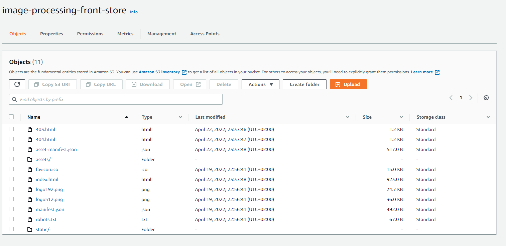

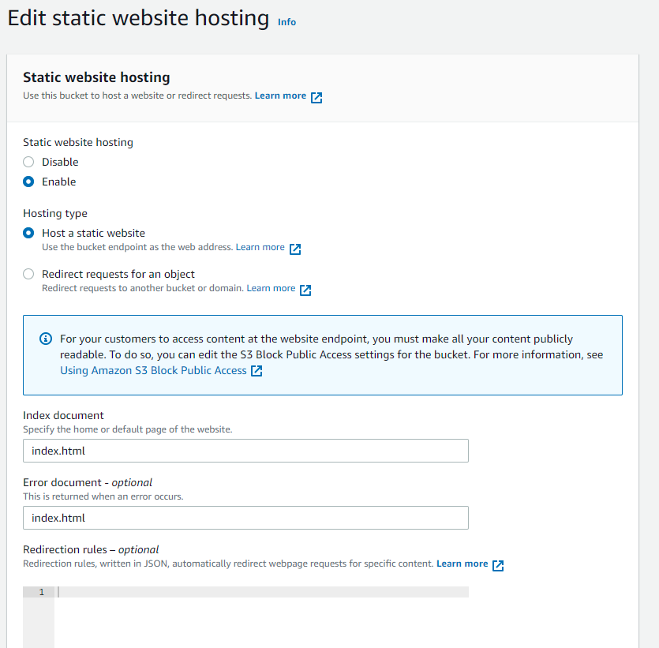

## S3 Bucket For Store Images
> Follow the structured linkes to can setup and configure AWS S3 Bucket

> We Turn Off public access becuse we use AWS CloudFront to serve the images
* Creating a bucket [see documentation](https://docs.aws.amazon.com/AmazonS3/latest/userguide/create-bucket-overview.html)
* Blocking public access to your Amazon S3 storage [see documentation](https://docs.aws.amazon.com/AmazonS3/latest/userguide/access-control-block-public-access.html)
* Enabling website hosting [see documentation](https://docs.aws.amazon.com/AmazonS3/latest/userguide/EnableWebsiteHosting.html) Be sure to set Error document to index.html to redirect 403 access denied
* Cross-origin resource sharing (CORS)  on Permissions tab
```
[
    {
        "AllowedHeaders": [],
        "AllowedMethods": [
            "GET",
            "HEAD"
        ],
        "AllowedOrigins": [
            "*"
        ],
        "ExposeHeaders": []
    }
]
```
* Bucket policy on Permissions tab
```
{
	"Version": "2008-10-17",
	"Id": "PolicyForCloudFrontPrivateContent",
	"Statement": [
		{
			"Effect": "Allow",
			"Principal": {
				"AWS": "arn:aws:iam::<Account ID>:user/<IAM Username>"
			},
			"Action": [
				"s3:GetObject",
				"s3:PutObject",
				"s3:PutObjectAcl",
				"s3:DeleteObject"
			],
			"Resource": "arn:aws:s3:::image-processing-thumb-store/*"
		},
		{
			"Sid": "1",
			"Effect": "Allow",
			"Principal": {
				"AWS": "arn:aws:iam::cloudfront:user/CloudFront Origin Access Identity <OAI ID>"
			},
			"Action": "s3:GetObject",
			"Resource": "arn:aws:s3:::image-processing-thumb-store/*"
		}
	]
}
```
* Create a file index.html to serve 403 error documents and uploaded to the bucket
```
<!DOCTYPE html><html lang="en"><head><meta charset="utf-8"><meta name="viewport" content="width=device-width, initial-scale=1, shrink-to-fit=no"><title>403 Access Denied</title><style>body{color: #444; margin: 0; font: normal 14px/20px Arial, Helvetica, sans-serif; height: 100%; background-color: #fff;}.Container{height: auto; min-height: 100%;}.Card{text-align: center; width: 800px; margin-left: -400px; position: absolute; top: 30%; left: 50%;}h1{margin: 0; font-size: 150px; line-height: 150px; font-weight: bold;}h2{margin-top: 20px; font-size: 30px;}</style></head><body><div class="Container"><div class="Card"><h1>403</h1><h2>Access Denied</h2><p>You don't have permission to access this object!</p></div></div></body></html>

```

* Our Final Setup Screenshot

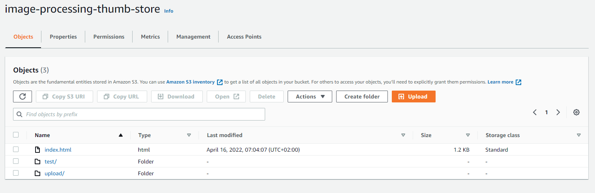


## CloudFront for S3 Static Bucket
> Follow the structured linkes to can setup and configure AWS S3 Bucket

> Turn Off public access on S3 Bbucket to extra secure we use AWS CloudFront to serve the static files
* Restricting access to Amazon S3 content by using an origin access identity (OAI) [see documentation](https://docs.aws.amazon.com/AmazonCloudFront/latest/DeveloperGuide/private-content-restricting-access-to-s3.html)
* Deploy a React-based single-page application to Amazon S3 and CloudFront [see documentation](https://docs.aws.amazon.com/prescriptive-guidance/latest/patterns/deploy-a-react-based-single-page-application-to-amazon-s3-and-cloudfront.html)
* Creating a distribution and point img-api.tk and www.img-api.tk to the CNAME section and select domain certificate from ssl  [see documentation](https://docs.aws.amazon.com/AmazonCloudFront/latest/DeveloperGuide/distribution-web-creating-console.html) 
* S3 origin with CloudFront[see documentation](https://docs.aws.amazon.com/whitepapers/latest/secure-content-delivery-amazon-cloudfront/s3-origin-with-cloudfront.html) 

* Our Final Setup Screenshot

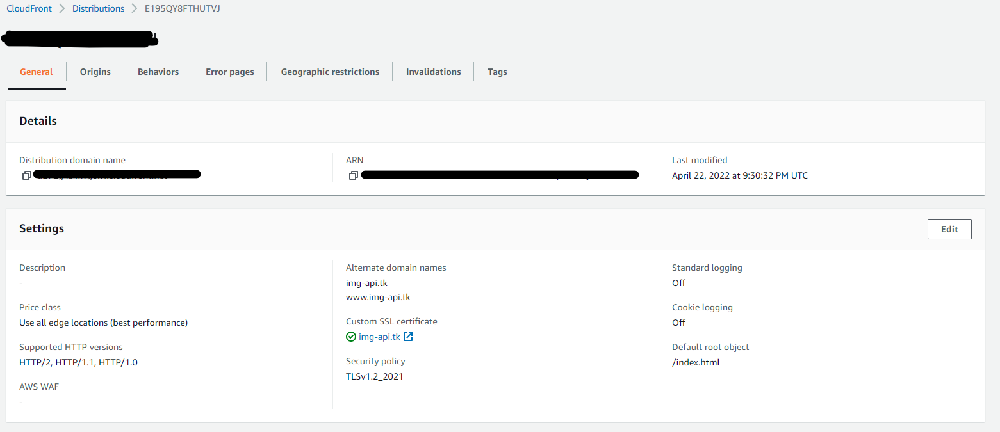

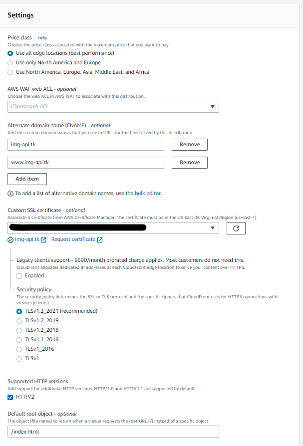

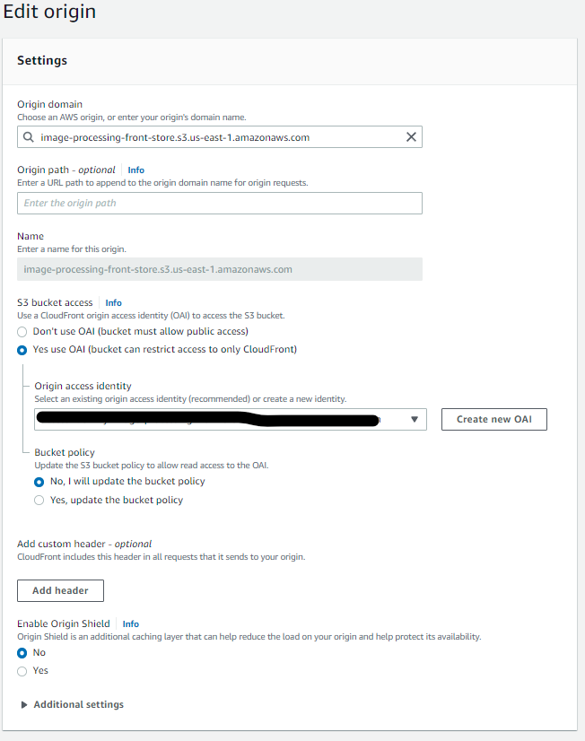

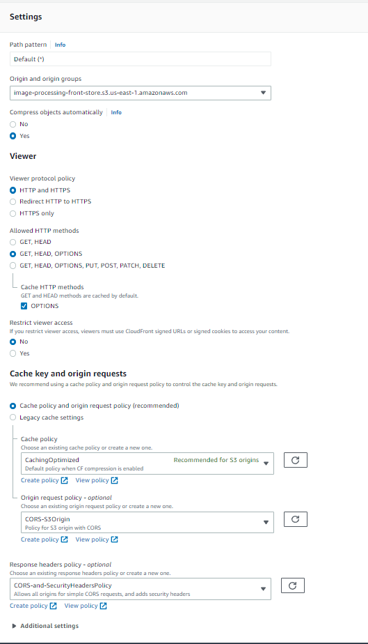


## CloudFront for S3 Images Store
> Follow the structured linkes to can setup and configure AWS S3 Bucket

> Turn Off public access on S3 Bbucket to extra secure we use AWS CloudFront to serve the static files
* Restricting access to Amazon S3 content by using an origin access identity (OAI) [see documentation](https://docs.aws.amazon.com/AmazonCloudFront/latest/DeveloperGuide/private-content-restricting-access-to-s3.html)
* Deploy a React-based single-page application to Amazon S3 and CloudFront [see documentation](https://docs.aws.amazon.com/prescriptive-guidance/latest/patterns/deploy-a-react-based-single-page-application-to-amazon-s3-and-cloudfront.html)
* Creating a distribution and point images.img-api.tk to the CNAME section and select domain certificate from ssl [see documentation](https://docs.aws.amazon.com/AmazonCloudFront/latest/DeveloperGuide/distribution-web-creating-console.html) 
* S3 origin with CloudFront [see documentation](https://docs.aws.amazon.com/whitepapers/latest/secure-content-delivery-amazon-cloudfront/s3-origin-with-cloudfront.html) 

* Our Final Setup Screenshot
> Same configuration but on origin we use images.img-api.tk

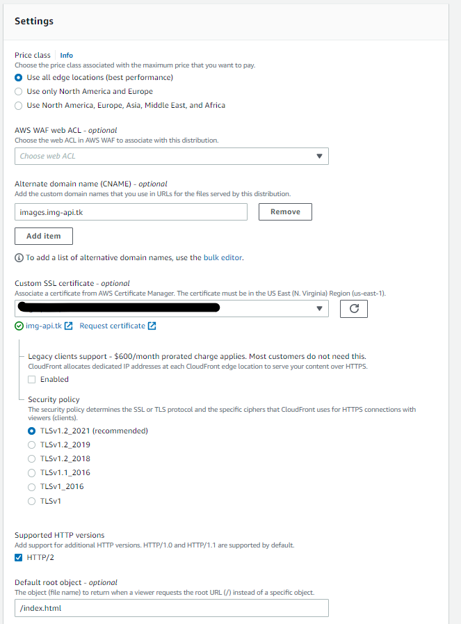


