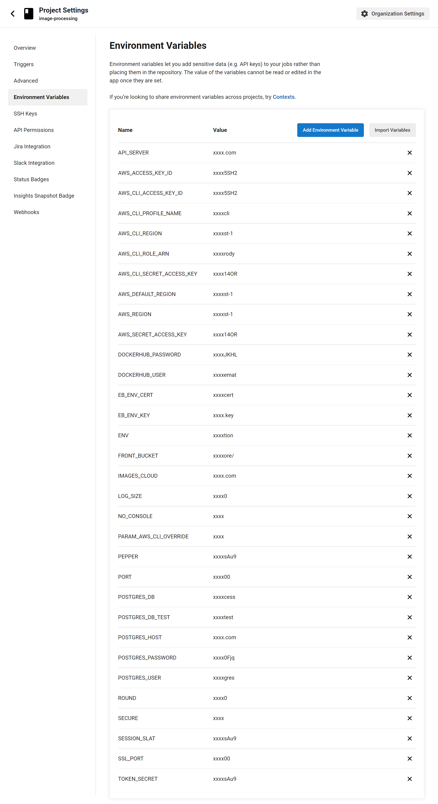
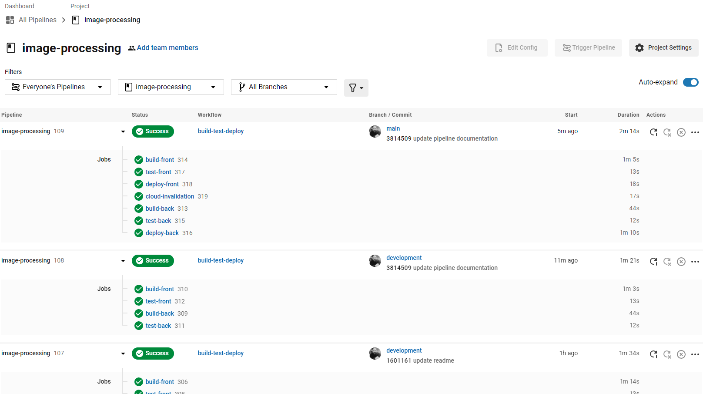
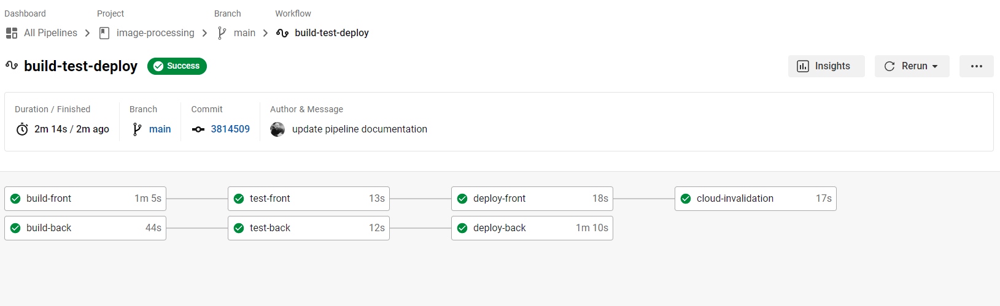
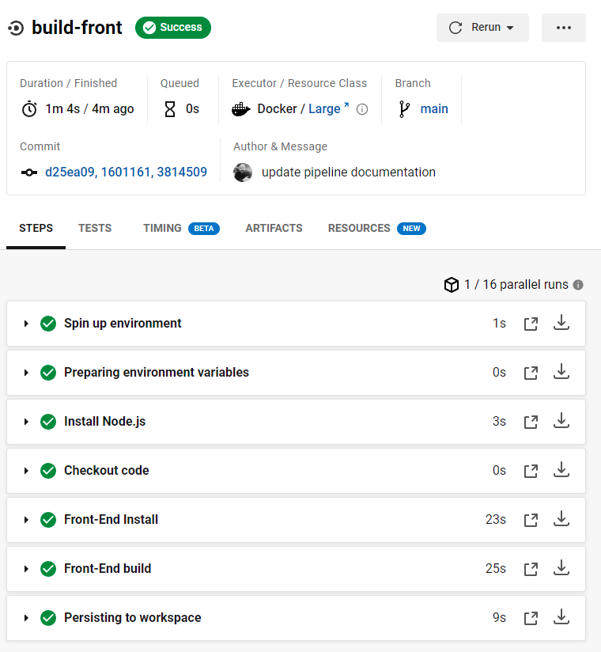
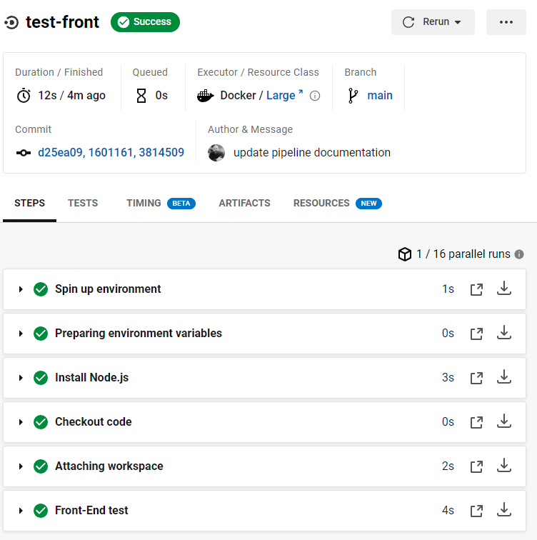
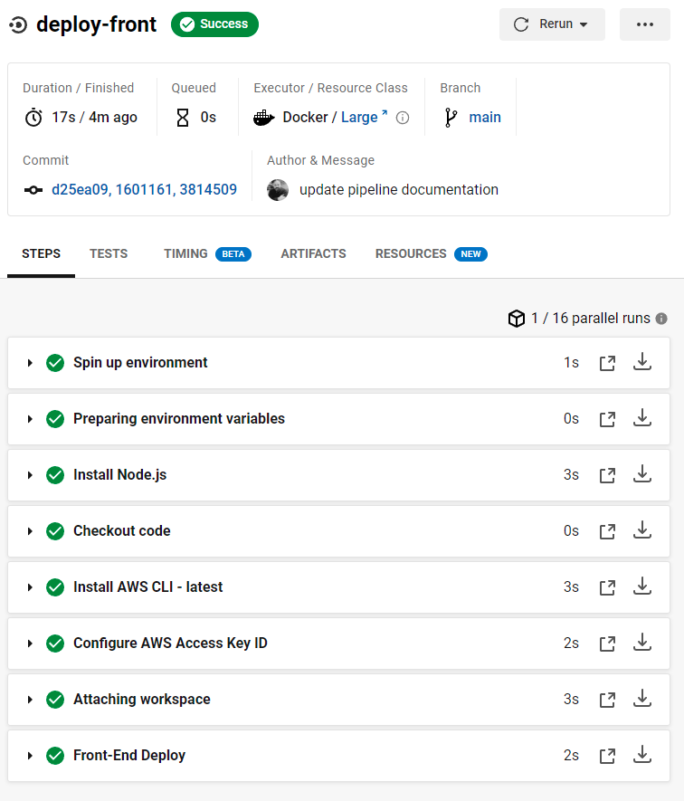
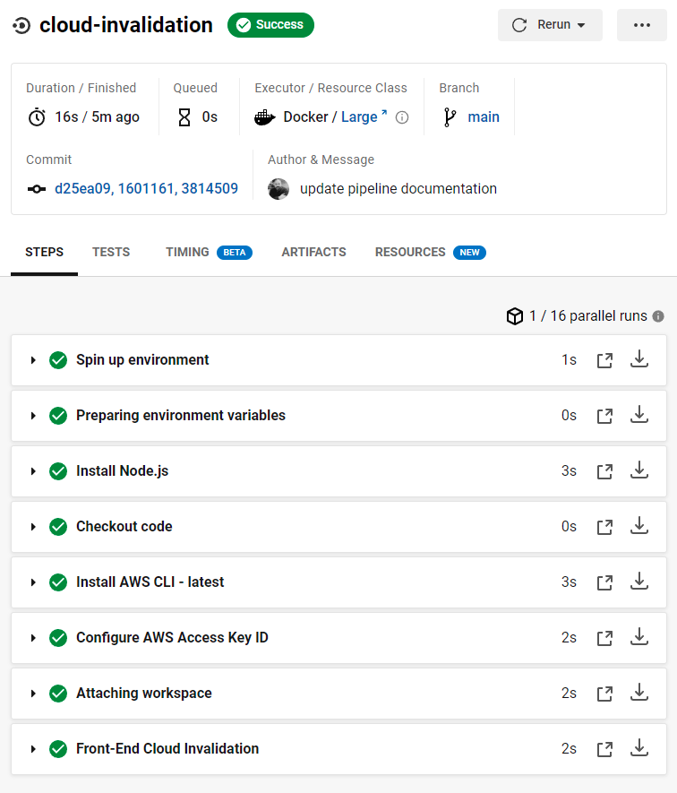
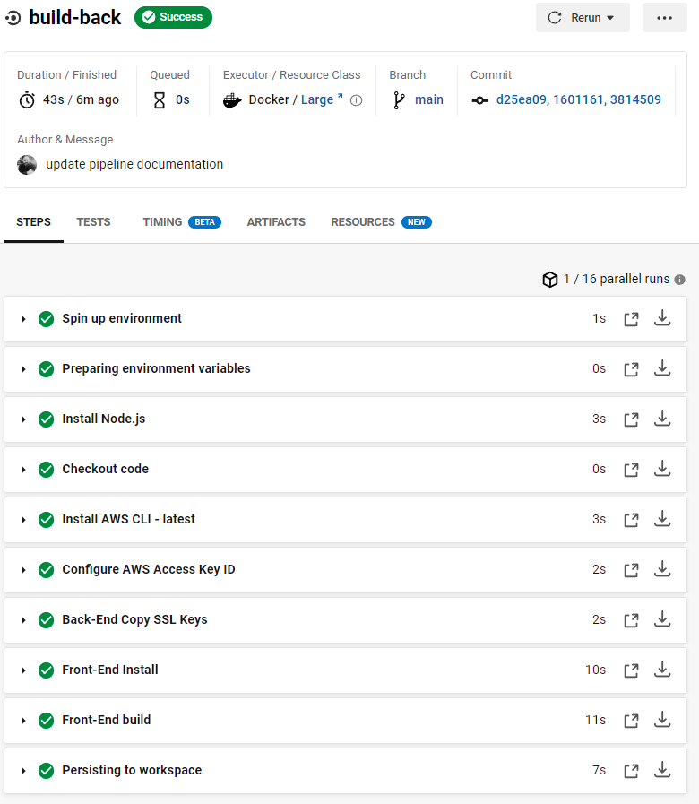
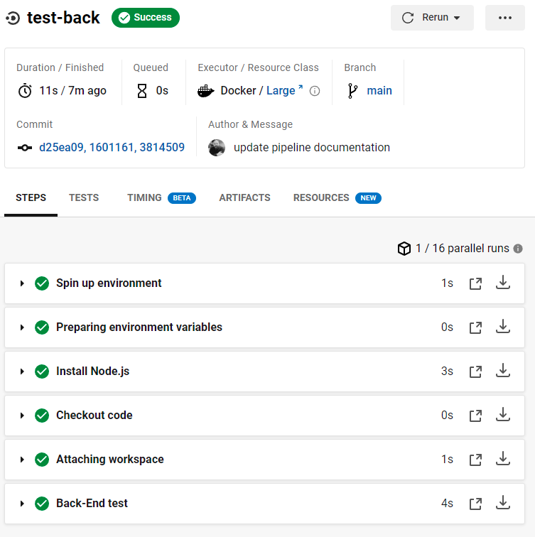
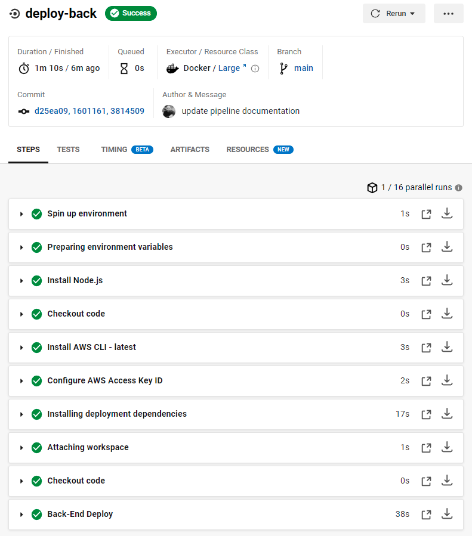

# Pipeline process

- [CircleCI Pipeline](#App-Directory) 
  - [Orbs](#Orbs)
  - [Jobs](#Jobs)
  - [Workflow Steps](#Workflow-Steps)
  - [Configure CircleCI Pipeline](#Configure-CircleCI-Pipeline)
  - [Setup Enviroment Virables on CircleCI Settings](#Setup-Enviroment-Virables-on-CircleCI-Settings)
  - [Screenshot for deploment](#Screenshot-for-deploment)


# CircleCI Pipeline

## Orbs

node: circleci/node@5.0.2
aws-cli: circleci/aws-cli@3.0.0
eb: installing awsebcli while deploying

## Jobs

### Frontend Jobs
1- build-front
job to build and install dependencies for frontend react app

2- test-front
job to test the front end react app

3- deploy-front
job to deploy front end react app

4- cloud-invalidation
 job to create invalidation for cached files from aws cloudfront after deployment

### Backend Jobs
1- build-back
job to build and install dependencies for backend API server

2- test-back
job to test backend API server

3- deploy-back
job to deploy backend API server to AWS Elastic Beanstalk

## Workflow Steps
- build-front 
    => test-fron 
        => deploy-front
            => cloud-invalidation

- build-back 
    => test-back 
        => deploy-back


## Configure CircleCI Pipeline
> The configuration inside .circleci/config.yml

> Note that deploy not run only for main branch
```
version: 2.1
orbs: # services included from cercleci to be instaled on the docker image
  node: circleci/node@5.0.2
  aws-cli: circleci/aws-cli@3.0.0

jobs: # deployment jobs

  build-front: # job to build and install dependencies for frontend react app
    docker: # configure the docker image
      - image: cimg/base:stable
    steps: # steps inside the job to run sequantly
      - node/install # installing nodejs
      - checkout # checkout the workspace to ensure we are running on our repo
      - run: # to tell cercleci to run the following command
          name: Front-End Install
          command: npm run frontend:install
      - run:
          name: Front-End build
          command: npm run frontend:build
      - persist_to_workspace: # save the working directory to work space to use it in the next job
          root: ~/project # save the workspace at project folder root
          paths: # include pathes to save
            - .
  
  test-front: # job to test the front end react app
    docker:
      - image: cimg/base:stable
    steps:
      - node/install
      - checkout
      - attach_workspace: # attaching the saved workspace from last job
          at: ~/project # from the root project we defined before
      - run:
          name: Front-End test
          command: npm run frontend:test

  deploy-front: # job to deploy front end react app
    docker:
      - image: cimg/base:stable
    steps:
      - node/install
      - checkout
      - aws-cli/setup: # install aws-cli and configure it
          configure-default-region: true 
          configure-profile-region: false 
          disable-aws-pager: true 
          override-installed: false 
          aws-access-key-id: AWS_CLI_ACCESS_KEY_ID
          aws-secret-access-key: AWS_CLI_SECRET_ACCESS_KEY
          aws-region: AWS_CLI_REGION
          profile-name: aws-cli
      - attach_workspace: # attaching the saved workspace from last job
          at: ~/project
      - run:
          name: Front-End Deploy
          command: npm run frontend:deploy

  cloud-invalidation: # job to create invalidation for cached files from aws cloudfront after deployment
    docker:
      - image: cimg/base:stable
    steps:
      - node/install
      - checkout
      - aws-cli/setup: # install aws-cli and configure it
          configure-default-region: true 
          configure-profile-region: false 
          disable-aws-pager: true 
          override-installed: false 
          aws-access-key-id: AWS_CLI_ACCESS_KEY_ID
          aws-secret-access-key: AWS_CLI_SECRET_ACCESS_KEY
          aws-region: AWS_CLI_REGION
          profile-name: aws-cli
      - attach_workspace: # attaching the saved workspace from last job
          at: ~/project
      - run:
          name: Front-End Cloud Invalidation
          command: npm run frontend:invalidation

  build-back: # job to build and install dependencies for backend API server
    docker:
      - image: cimg/base:stable
    steps:
      - node/install
      - checkout
      - aws-cli/setup: # install aws-cli and configure it
          configure-default-region: true 
          configure-profile-region: true 
          disable-aws-pager: true 
          override-installed: false 
          aws-access-key-id: AWS_CLI_ACCESS_KEY_ID
          aws-secret-access-key: AWS_CLI_SECRET_ACCESS_KEY
          aws-region: AWS_CLI_REGION
          profile-name: aws-cli
      - run:
          name: Back-End Copy SSL Keys
          command: npm run backend:cert
      - run:
          name: Front-End Install
          command: npm run backend:install
      - run:
          name: Front-End build
          command: npm run backend:build
      - persist_to_workspace: # save the working directory to work space to use it in the next job
          root: ~/project
          paths:
            - .
  
  test-back: # job to test backend API server
    docker:
      - image: cimg/base:stable
    steps:
      - node/install
      - checkout
      - attach_workspace: # attaching the saved workspace from last job
          at: ~/project
      - run:
          name: Back-End test
          command: npm run backend:test

  deploy-back: # job to deploy backend API server to AWS Elastic Beanstalk
    docker:
      - image: cimg/base:stable
    steps:
      - node/install
      - checkout
      - aws-cli/setup: # install aws-cli and configure it
          configure-default-region: true 
          configure-profile-region: true 
          disable-aws-pager: true 
          override-installed: false 
          aws-access-key-id: AWS_CLI_ACCESS_KEY_ID
          aws-secret-access-key: AWS_CLI_SECRET_ACCESS_KEY
          aws-region: AWS_CLI_REGION
          profile-name: aws-cli
      - run: # install aws eb-cli 
          name: Installing deployment dependencies
          working_directory: /
          command: |
            sudo apt-get -y -qq update
            sudo apt-get install python3-pip python3-dev build-essential
            sudo pip3 install awsebcli
      - attach_workspace: # attaching the saved workspace from last job
          at: ~/project
      - checkout
      - run:
          name: Back-End Deploy
          command: npm run backend:deploy

  
workflows: # workflow to run jobs on conditional steps
  build-test-deploy: # work flow to build then test then deploy process
    jobs:
    # fornt end steps
      - build-front # call build job to build forntend dependencies
      - test-front: # call test job for testing frontend
          requires: # cannot process this job its require the build step
            - build-front      
      - deploy-front: # call deploy job to deploy frontend to aws s3 bucket
          requires: # cannot process this job its require the test step
            - test-front
          filters: # filter this job to run only on master bruch on our repo after pushing
            branches:
              only: main
      - cloud-invalidation: # call invalidation job to clear cached files from aws cloudfront after deployment
          requires: # cannot process this job its require the deploy step
            - deploy-front

    # backend steps
      - build-back # call build job to build backend dependencies
      - test-back: # call test job for testing backend
          requires: # cannot process this job its require the build step
            - build-back
      - deploy-back: # call deploy job to deploy backend  to aws elastic beanstalk
          requires: # cannot process this job its require the test step
            - test-back
          filters: # filter this job to run only on master bruch on our repo after pushing
            branches:
              only: main
      

```

## Setup Enviroment Virables on CircleCI Settings


## Screenshot for deploment
> Every stack run in parrell and depends on other jobs

> first build if succeded run test if succeded run deploy and eatch of front and end run in parrell 












